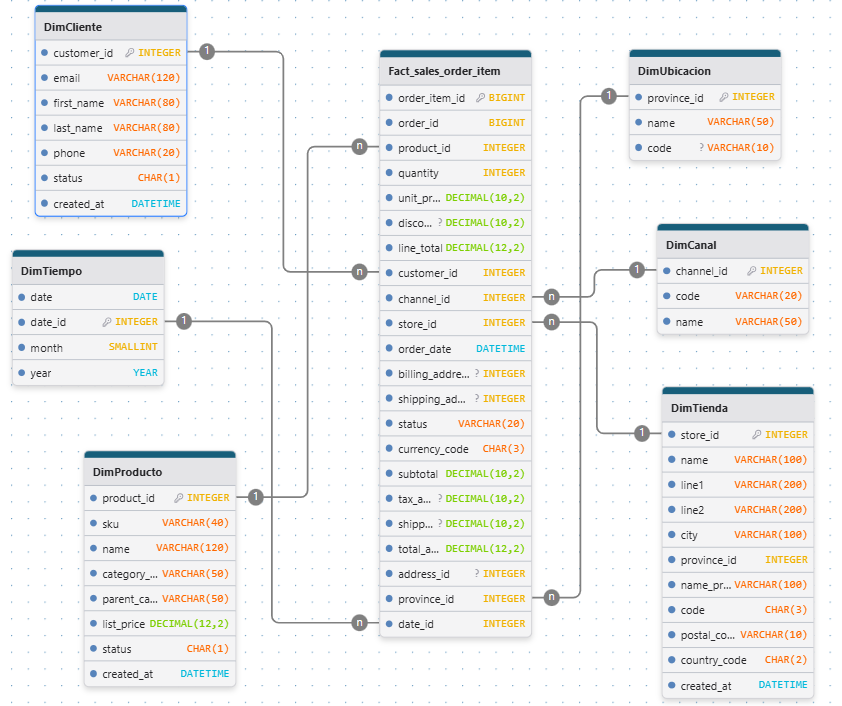
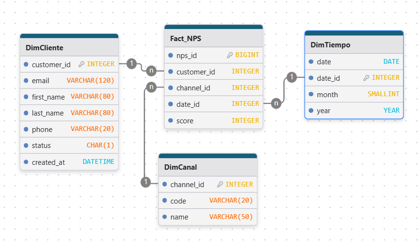
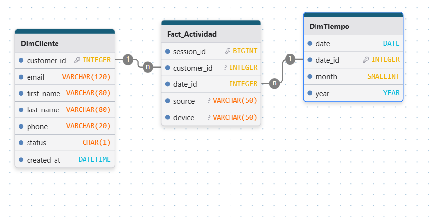
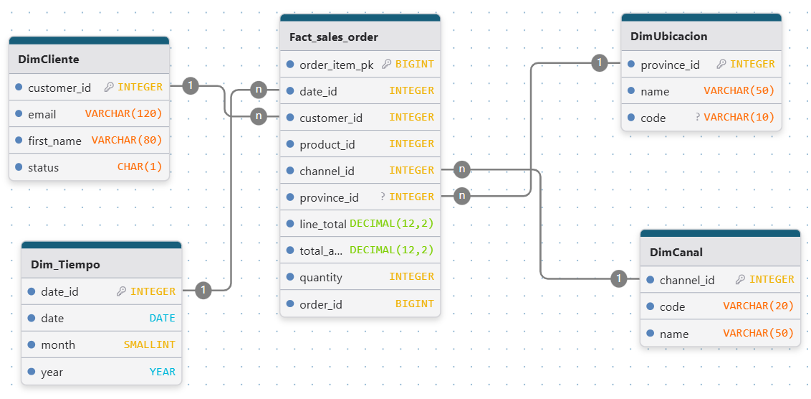
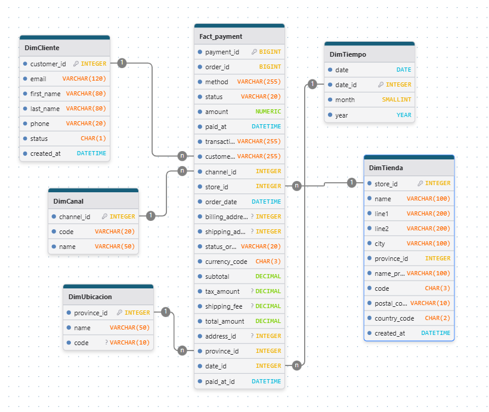
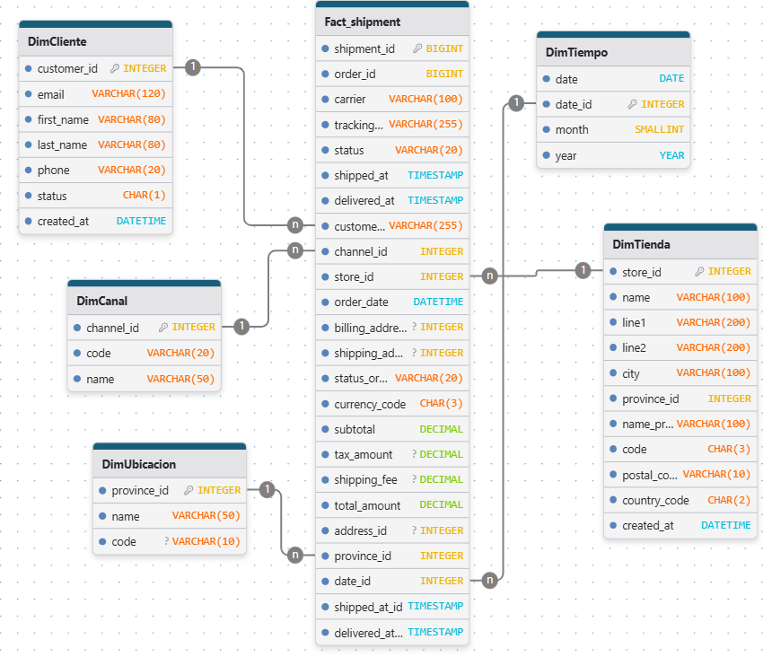

## 📊 TP Final – Mini Data Warehouse & Dashboard Comercial
## 👩‍💻 Carrera: Lic. en Ciencia de Datos
## 🧠 Materia: Introducción al Marketing Online y Negocios Digitales
## 📂 Proyecto: Ecosistema de datos EcoBottle AR
### 📝 Introducción

Este proyecto implementa un **mini-ecosistema de datos comercial (online + offline)** para la empresa ficticia EcoBottle AR.
El objetivo fue construir un Data Warehouse (DW) modelado en estrella y un **Dashboard**, siguiendo las mejores prácticas vistas en clase.

Se trabajó con datos RAW provistos en archivos .csv, los cuales fueron transformados mediante scripts en Python para crear tablas dimensión y de hechos, almacenadas en la carpeta DW/.


---

### 🎯 Objetivos del Proyecto

Según la consigna del TP, se debían cumplir los siguientes puntos:

| # | Tarea                                               | 
| - | --------------------------------------------------- | 
| 1 | Modelado estrella con todas las tablas              | 
| 2 | Transformación de datos RAW a DW                    | 
| 3 | Scripts Python para generar dimensiones y hechos    | 
| 4 | Script `main.py` para ejecutar todo                 | 
| 5 | Dashboard conectado al DW                           | 
| 6 | Entrega con README + requirements + entorno virtual | 


---
### 🧠 Caso de estudio: EcoBottle AR

EcoBottle AR vende botellas reutilizables online y en tiendas físicas.
Marketing genera tráfico vía redes sociales y email, y se envía NPS post-compra.

Los datos incluyen:

 Ventas y líneas de pedido
 Clientes
 Tiendas
 Sesiones web
 Pagos
 Envíos
 Encuestas NPS

### 🏗️ Arquitectura del Proyecto
  ```bash
MKT_TP_FINAL/
├── raw/                
├── DW/                  
├── esquemas/           
├── venv/               
├── *.py               
│   ├── DimCanal.py
│   ├── DimCliente.py
│   ├── DimProducto.py
│   ├── DimTiempo.py
│   ├── DimTienda.py
│   ├── DimUbicacion.py
│   ├── FactNPS.py
│   ├── FactActividades.py
│   ├── FactSalesOrder.py
│   ├── FactSalesOrderItem.py
│   ├── Factpayment.py
│   ├── Factshipment.py        
│   └── main.py         
├── requirements.txt
└── README.md
 ```

### ⚙️ Estructura del Repositorio

| Carpeta | Contenido |
| :--- | :--- |
| **`RAW/`** | Datos fuente originales en formato `.CSV` (ventas, clientes, sesiones, etc.). |
| **`src/`** | Scripts de Python (`.py`) para la lógica de **ETL (Extract, Transform, Load)**. |
| **`DW/`** | Archivos de salida `.CSV` que representan el **Data Warehouse** (Tablas de Hechos y Dimensiones). |
| **`Esquemas/`** | Diagramas del Modelo Estrella (FactVentas, FactActividad, FactNPS). |
| **`venv/`** | Entorno virtual de Python (buenas prácticas). |
| **`requirements.txt`**| Dependencias necesarias para ejecutar los scripts (principalmente `pandas`). |

---
### ⭐ Modelado Estrella
## Dimensiones creadas

| Dimensión    | Contenido                       |
| ------------ | ------------------------------- |
| DimCliente   | Info del cliente                |
| DimProducto  | SKU, nombre, categoría          |
| DimUbicacion | Provincias y direcciones        |
| DimCanal     | Canal de venta (online/offline) |
| DimTienda    | Tiendas físicas                 |
| DimTiempo    | Año, mes, día                   |

## Hechos creados


| **Tabla de Hecho**          |   **Grano**               |
|-----------------------------|---------------------------|
| **Fact_NPS**                | Una fila en la tabla de hechos representa la calificación NPS (Net Promoter Score) específica proporcionada por un cliente en un momento dado (fecha)<br>y a través de un canal de encuesta particular. |
| **Fact_Actividad**          | Una fila en la tabla de hechos representa una sesión de actividad única realizada por un cliente en una fecha específica,<br>registrando la fuente de tráfico (source) y el tipo de dispositivo (device) utilizado. |
| **Fact_sales_order_item**   | Una fila en la tabla de hechos representa un ítem o línea de producto única dentro de un pedido de venta,<br>detallando la cantidad y precio de un producto específico vendido a un cliente en una fecha determinada, a través de un canal, en una tienda y con una ubicación de envío/facturación asociada. |
| **Fact_sales_order**        | Una fila en la tabla de hechos representa un pedido de venta completo único (una orden) realizado en una fecha específica<br>y asociado a una tienda y una ubicación de envío/facturación. |
| **Fact_payment**            | Una fila en la tabla de hechos representa un pago único y específico (payment_id) realizado por un cliente para un pedido (order_id) en una fecha y hora determinadas,<br>asociado a un método de pago, un canal de venta, una tienda y una ubicación de facturación. |
| **Fact_shipment**           | Una fila en la tabla de hechos representa un envío único (shipment_id) de un pedido (order_id), detallando la transportadora (carrier), el estado (status)<br>y las fechas de envío (shipped_at) y entrega (delivered_at), asociado a un cliente, un canal, una tienda y una ubicación de envío. |


# 🌟 Modelos de Datos 

Aquí se presentan los esquemas estrella de las principales tablas de hechos del Data Warehouse

---

## 1. Fact_sales_order_item (Ventas por Artículo)

Un análisis detallado de cada producto vendido.



---

## 2. Fact_NPS (Net Promoter Score)

Medición de la satisfacción del cliente.



---

## 3. Fact_Actividad (Actividad del Cliente)

Registro de sesiones y comportamiento en el sitio.



---

## 4. Fact_sales_order (Pedidos de Venta)

Análisis de los pedidos completos.



---

## 5. Fact_payment (Pagos)

Registro detallado de cada transacción de pago.



---

## 6. Fact_shipment (Envíos/Logística)

Seguimiento y estado de cada proceso de envío.




## 🚀 Guía de Ejecución

Sigue estos pasos para levantar el entorno y procesar los datos:

### 1. Preparación del Entorno (Consola)

Asegúrate de estar en la carpeta raíz del proyecto (`mkt_tp_final`) y ejecuta:

1.  **Activar Entorno Virtual:**
    ```bash
    # Windows (PowerShell)
    .\venv\Scripts\Activate
    # Mac/Linux
    source venv/bin/activate
    ```
2.  **Instalar Dependencias:**
    ```bash
    pip install -r requirements.txt
    ```

### 2. Ejecución del Proceso ETL (Consola)

Una vez activo el entorno, ejecuta los scripts de transformación en el orden correcto (Dimensiones antes que Hechos):

```bash
    python main.py
```
#### Esto
lee los archivos de raw/, 
transforma los datos y
guarda las tablas en DW/

# 📊 Dashboard Power BI

### Fuentes

Conectado directamente a los archivos .csv de la carpeta DW/.

### Dashboard


